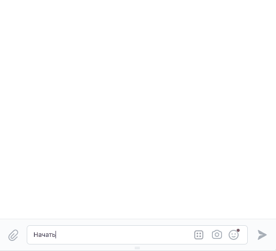
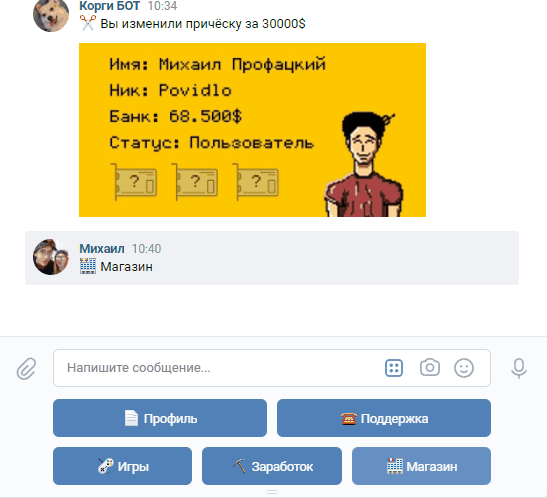
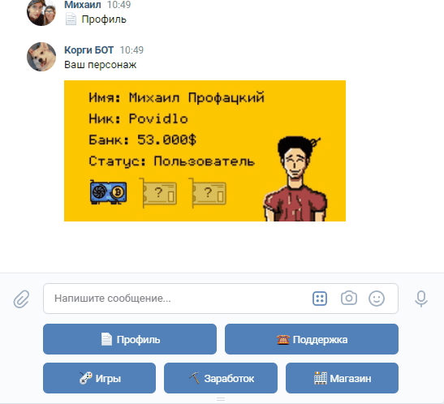

# vk-game-bot
## Описание

Игровой чат-бот в ВКонтакте
* [VKBottle](https://github.com/vkbottle/vkbottle)
* [Pillow для генерации изображений](https://github.com/python-pillow/Pillow)
* [Tortoise ORM](https://github.com/tortoise/tortoise-orm)
* [Aerich для миграций](https://github.com/tortoise/aerich)
* База данных SQLite

## Основной функционал:
* Регистрация и создание персонажа

---
* Изменение внешности персонажа (одежда, прическа, лицо, цвет кожи)

---
* Заработок монеток (покупка видеокарт, приносящих прибыль)

--- 
* Игры (блэкджек, камень-ножницы-бумага, монетка)


## Настройка виртуального окружения и установка зависимостей
```
> python -m venv venv

> venv\Scripts\activate.bat - для Windows

> source venv/bin/activate - для Linux и MacOS

> python -m pip install -r requirements.txt
```

## Конфиг
Переименуйте файл .env.example в .env и укажите в нем токен вашего сообщества ВК
```
TOKEN = токен сообщества ВК
```

## Применение миграций
```
> aerich upgrade
```

### Возникли вопросы?
ВКонтакте: https://vk.com/profatsky

Telegram: @profatsky