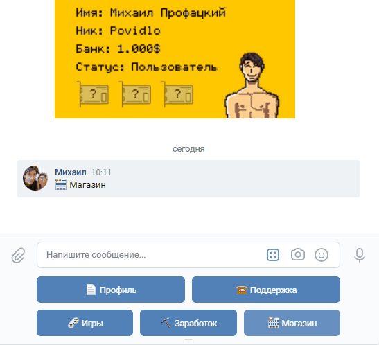
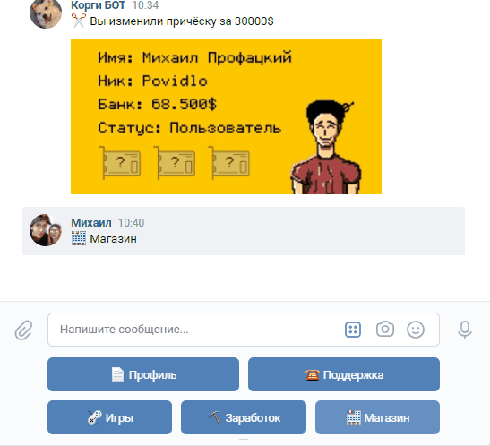
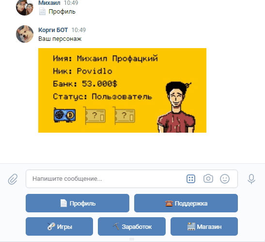

# vk-game-bot
## Описание

Игровой чат-бот в ВКонтакте, написанный на Python с помощью <a href="https://github.com/vkbottle/vkbottle">VKBottle</a> и <a href="https://github.com/python-pillow/Pillow">Pillow</a>

---
## Основной функционал:
* Регистрация и создание персонажа

---
* Изменение внешности персонажа (одежда, прическа, лицо, цвет кожи)

---
* Заработок монеток (покупка видеокарт, приносящих прибыль)

--- 
* Игры (блэкджек, камень-ножницы-бумага, монетка)


## Настройка виртуального окружения и установка зависимостей
```
> python -m venv venv

> venv\Scripts\activate.bat - для Windows

> source venv/bin/activate - для Linux и MacOS

> python -m pip install -r requirements.txt
```

## Конфиг
Переименуйте файл .env.example в .env, укажите токен сообщества ВК и необходимые данные для подключения к MySQL
```
TOKEN = токен сообщества ВК

DB_NAME = имя БД
DB_HOST = localhost
DB_USER = пользователь БД
DB_PASSWORD = пароль БД
```
