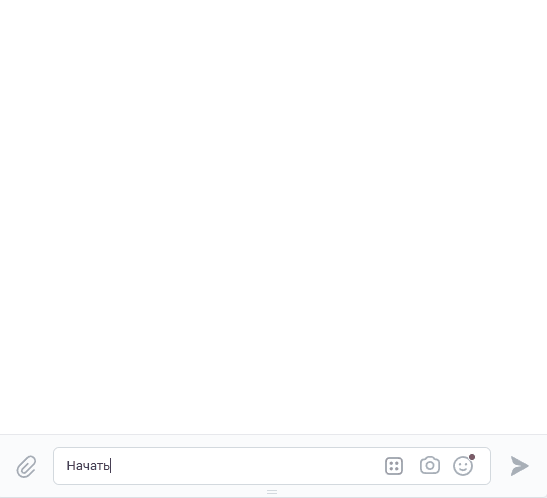
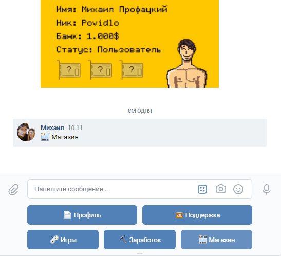

# vk-game-bot

Игровой чат-бот в ВКонтакте, написанный на Python, с регистрацией пользователей, кастомизацией созданных персонажей, заработком внутриигровой валюты, тех.поддержкой и админ панелью.

## Технологии
* [VKBottle](https://github.com/vkbottle/vkbottle)
* [Pillow для генерации изображений](https://github.com/python-pillow/Pillow)
* [Tortoise ORM](https://github.com/tortoise/tortoise-orm)
* [Aerich для миграций](https://github.com/tortoise/aerich)
* SQLite

## Основной функционал:
* Регистрация и создание персонажа

---
* Изменение внешности персонажа (одежда, прическа, лицо, цвет кожи)

---
* Заработок монеток (покупка видеокарт, приносящих прибыль)

--- 
* Игры (блэкджек, камень-ножницы-бумага, монетка)


## Инструкция по настройке и запуску
### Настройка виртуального окружения и установка зависимостей
```
$ python -m venv venv

$ venv\Scripts\activate.bat - для Windows

$ source venv/bin/activate - для Linux и MacOS

$ python -m pip install -r requirements.txt
```

### Конфиг
Переименуйте файл .env.example в .env и укажите в нем токен вашего сообщества и ID вашего профиля ВК
```
TOKEN = токен сообщества ВК

ADMIN_ID = ID администратора
```

### Применение миграций
```
$ aerich upgrade
```

### Запуск
```
$ cd src

$ python main.py
```

## Возникли вопросы?
ВКонтакте: https://vk.com/profatsky

Telegram: @profatsky